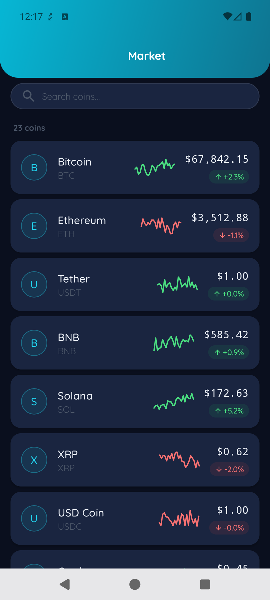
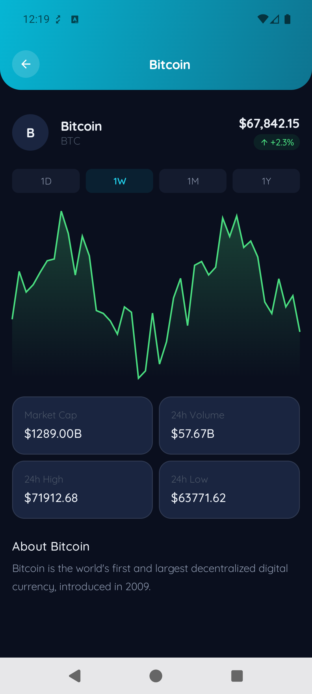

# CryptoX

A **Kotlin Multiplatform** (Android-first) crypto portfolio & market tracker,
built entirely with **Compose Multiplatform** — zero XML — following **Clean
Architecture** and the **MVI** pattern.

Targets: **Android** and **iOS** (shared Compose UI).

## Features

- **Market** — live coin list with debounced search (300 ms), pull-to-refresh,
  and full loading / error / empty states.
- **Coin Detail** — header with price & 24h change, an **interactive line chart
  drawn with Compose `Canvas`** (touch-scrub price readout), range chips
  (1D / 1W / 1M / 1Y), a stats grid, and a description.
- **Design system** — a themed `CryptoX*` component library (dark-first) with
  design tokens and light/dark previews.

> Data is currently served by a `FakeCoinRepository` (realistic coins, simulated
> latency, injectable failures). The real network/database layer plugs in behind
> the `CoinRepository` interface with no feature-code changes.

## Screenshots

| Market | Coin Detail |
|---|---|
|  |  |

## Module map

```
androidApp                     Android app + demo NavHost host
shared                         KMP shared code + iOS entry point
core:designsystem              CryptoX* components, theme, tokens
core:mvi                       BaseViewModel (MVI foundation)
core:domain                    models + CoinRepository interface
core:data                      FakeCoinRepository + Koin dataModule
feature:market                 market list (MVI)
feature:detail                 coin detail + interactive chart (MVI)
```

See [docs/ARCHITECTURE.md](docs/ARCHITECTURE.md) for the dependency graph and
data flow.

## Tech stack

Compose Multiplatform · Material 3 · Kotlin Coroutines/Flow · Koin (DI) ·
Navigation-Compose (type-safe routes) · a custom MVI `BaseViewModel` ·
`kotlinx.collections.immutable` · Turbine + coroutines-test.

## Quick start

```bash
# Android
./gradlew :androidApp:assembleDebug     # build
./gradlew :androidApp:installDebug      # install on device/emulator

# Tests
./gradlew :feature:market:testDebugUnitTest :feature:detail:testDebugUnitTest
```

iOS: open [`/iosApp`](./iosApp) in Xcode and run.

The Android app launches a demo host: Market list → tap a coin → Coin Detail → back.

## Documentation

Full docs live in [`/docs`](docs/README.md):

| Doc | Contents |
|-----|----------|
| [Architecture](docs/ARCHITECTURE.md) | Layers, module graph, data flow, tech stack. |
| [Modules](docs/MODULES.md) | Every module explained. |
| [MVI](docs/MVI.md) | The `BaseViewModel` contract, with a worked example. |
| [Design System](docs/DESIGN_SYSTEM.md) | Tokens, theme, `CryptoX*` components. |
| [Getting Started](docs/GETTING_STARTED.md) | Build, test, and add a feature. |

Per-area implementation briefs are in [`/plans`](plans).

## Conventions

- **Zero XML** — Compose only.
- **MVI everywhere** — UI reads `state`, sends `intent`s; navigation/messages are `effect`s.
- **Tokens only** — no hardcoded colors/spacing in features.
- Every screen handles **loading / error / empty** states.

---

Learn more about [Kotlin Multiplatform](https://www.jetbrains.com/help/kotlin-multiplatform-dev/get-started.html)
and [Compose Multiplatform](https://www.jetbrains.com/help/kotlin-multiplatform-dev/compose-multiplatform.html).
