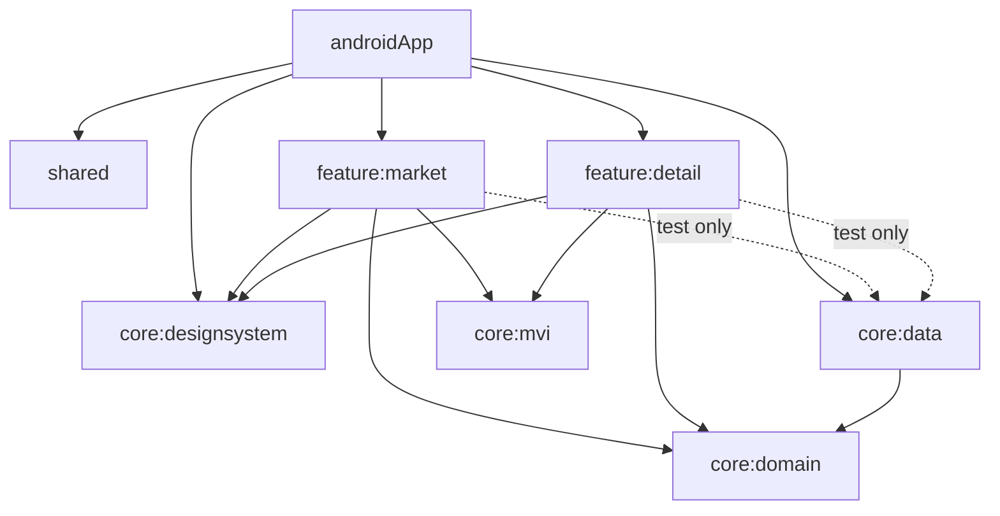
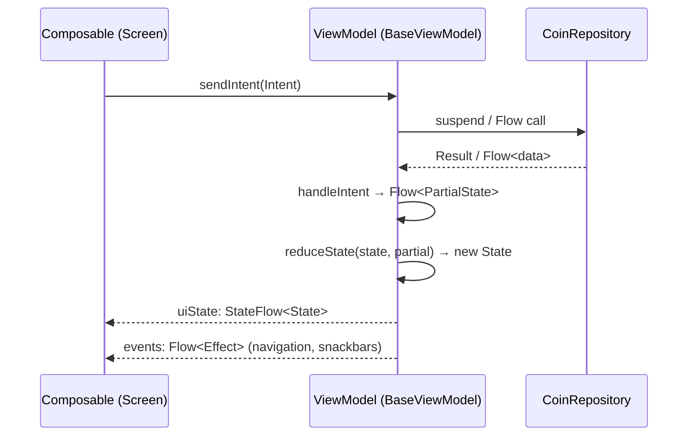

# Architecture

## Goals

- **Android-first Kotlin Multiplatform**, ready to share the same UI and logic with iOS.
- **Zero XML** — every screen and component is Compose Multiplatform.
- **Clean Architecture** — features depend on abstractions (`domain`), never on concrete data.
- **MVI** — a single, predictable state stream per screen.
- **Parallel-friendly modularization** — design system, features, and data evolve independently.

## Layers

```
┌──────────────────────────────────────────────┐
│  Presentation   feature:market, feature:detail│  Compose UI + MVI ViewModels
├──────────────────────────────────────────────┤
│  Design System  core:designsystem             │  CryptoX* components, theme, tokens
├──────────────────────────────────────────────┤
│  Domain         core:domain                    │  Models + CoinRepository interface
├──────────────────────────────────────────────┤
│  Data           core:data                      │  FakeCoinRepository (real layer later)
├──────────────────────────────────────────────┤
│  Foundation     core:mvi, shared               │  BaseViewModel, app entry/platform glue
└──────────────────────────────────────────────┘
```

**The dependency rule:** arrows only point downward. A feature knows the
`CoinRepository` *interface* (domain) but never the `FakeCoinRepository`
*implementation* (data). Swapping fake data for a real network/database layer is
a one-line change in `dataModule` — no feature code changes.

## Module graph



Each module owns its own `build.gradle.kts` and Android `namespace`. Modules that
render UI apply the Compose plugins; `core:mvi`, `core:domain`, and `core:data`
are plain KMP libraries.

## Data flow (MVI)



The UI is a pure function of `State`. One-off things that must **not** be
replayed on recomposition (navigation, transient errors) travel as `Effect`s on a
separate channel. See [MVI.md](MVI.md) for the full contract.

## Navigation

Destinations are type-safe `@Serializable` classes/objects. Each feature exposes:

- a destination (`MarketDestination`, `DetailDestination(coinId)`),
- a `NavGraphBuilder.<feature>Screen(...)` extension that registers it,
- a stateless `@Composable <Feature>Route(...)` entry point that pulls its
  ViewModel from Koin and forwards navigation as lambdas.

Features never reference each other. The host (currently `androidApp`'s
`CryptoXDemoApp`, later the app-shell module) wires them together:

```kotlin
marketScreen(onNavigateToDetail = { id -> navController.navigate(DetailDestination(id)) })
detailScreen(onBack = { navController.popBackStack() })
```

## Dependency injection

Koin. Every module contributes a Koin module:

- `dataModule` binds `CoinRepository` → `FakeCoinRepository`.
- `marketModule` / `detailModule` provide the ViewModels via `viewModelOf`.

`androidApp` starts Koin in `CryptoXApp.onCreate()` with all three modules.

## Tech stack

| Concern | Choice |
|---------|--------|
| UI | Compose Multiplatform 1.10 + Material 3 |
| State | Custom MVI `BaseViewModel` (coroutines `Channel` + `scan`) |
| DI | Koin 4 |
| Navigation | Navigation-Compose (type-safe routes) |
| Async | Kotlin Coroutines + Flow |
| Immutable UI state | `kotlinx.collections.immutable` |
| Testing | `kotlin-test`, `kotlinx-coroutines-test`, Turbine |

## Deviations from the plans

The briefs in [`/plans`](../plans) were written before implementation. Two
intentional differences, both to match the **TaminHamrahCMP** reference project:

1. **Component naming.** The design-system components ship with the `CryptoX*`
   prefix (`CryptoXCard`), not the `CX*` prefix the contract drafted. Code
   against the real names.
2. **MVI base.** Screens use `core:mvi`'s
   `BaseViewModel<STATE, PARTIAL_STATE, EVENT, INTENT>` (partial-state reducer),
   not the simpler `MviViewModel<S, I, E>` sketched in the plan.
